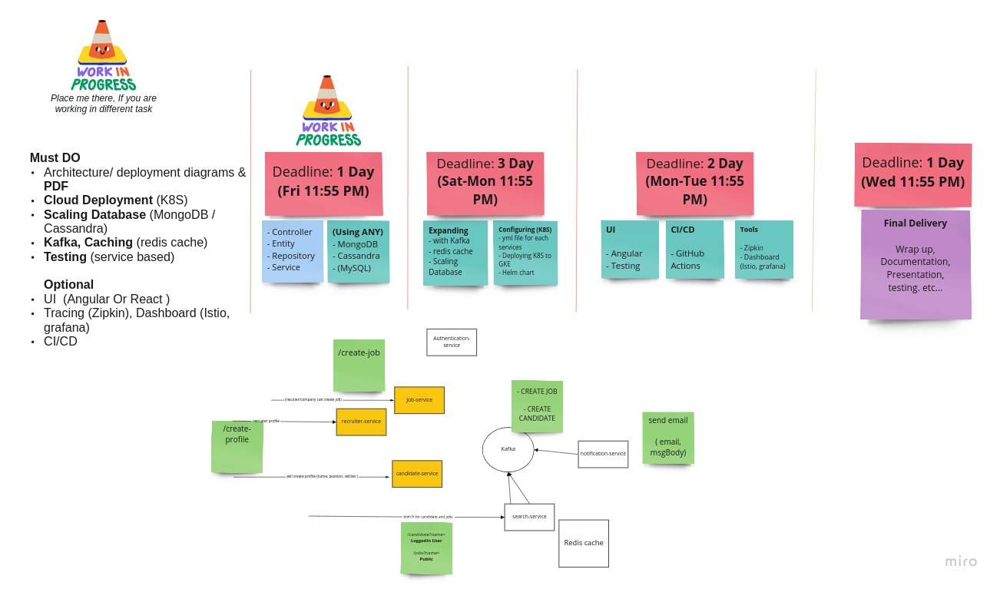

### Mind Map


## # How to run ? 

### __Development:__
1. Running Single Service at a time:
    - __If Using IDE__: Run each services by clicking their "run" icon
    - __Using only CMD__ : On terminal of specific service, type `mvn spring-boot:run`
    - __JAR file__: First, Create jar `mvn clean install` and run `java -jar target/service1.jar`

2. Running the application using docker
    - If cloned first time, In the root directory run `mvn clean install` or use IDE, maven -> lifecycle -> install (to create jar for all services)
    - Then, In terminal type: `docker compose up`. (this will run mysql, and other services)

    ```cmd 
   mvn clean install -DskipTests
   docker compose up
    ```
  
> Check docs/dev folder README, to start the required services. "MongoDB", "Kafka", "Redis" ..  
  
### __Deployment K8S:__
```cmd
mvn clean install -DskipTests

# If minkiube, also run -> minikube docker-env
docker compose build

# app-cores: All configs and DB, services: all services
kubectl create -f k8s/app-cores
kubectl create -f services

# add "192.168.49.2 jobapp.swa.local" to /etc/host
sudo nano /etc/hosts

==========================
127.0.0.1	localhost
192.168.49.2 jobapp.swa.local
==========================
```

### __Testing Deployed Services__  
```
# FROM: "auth-service", This is for create user

curl --location --request POST 'http://jobapp.swa.local/auth/create-user' \
--header 'Content-Type: application/json' \
--data-raw '{
    "fullName": "Test user",
    "email": "test1",
    "password": "test1"
}'

# FROM: "auth-service", This is for Login

curl --location --request POST 'http://jobapp.swa.local/auth/login' \
--header 'Content-Type: application/json' \
--data-raw '{
    "username": "test1",
    "password": "test1"
}'
```
  

## # How to create this project, and how to add new modules/services ?  
__Steps: Creating multi-module project__  
1. Create new project "swa-2", and select buildSystem maven.
2. Then either Create new services or Add existing ones
   - __Create (New Module):__ right click on project "swa-2" and create any module
      - e.g click on: new -> module -> springInitializr
   - __Add (Add Module):__ right click on "swa-2", open module settings
     - then under that Settings -> Modules -> click on + -> import module -> Select .pom file or directory -> then import module from external model -> select maven -> Apply
   - After that go to pom.xml of root project "swa-2" and add to `<modules> ... <modules>`

## # How to contribute to the project ?

__INSTRUCTION:__
1. Use _"develop"_ branch to make and commit changes.
2. We will merge to __"main"__ on the day-end or when services are integrated and working fine.

>  __Want to know, What to contribute and how to do it ?__ 
> 
> Please, Check out [TODO.md](./TODO.md) , and discuss with the team

--- 

## # Need Further help ?

__Reach out team-mates to Discuss and do it together.__


